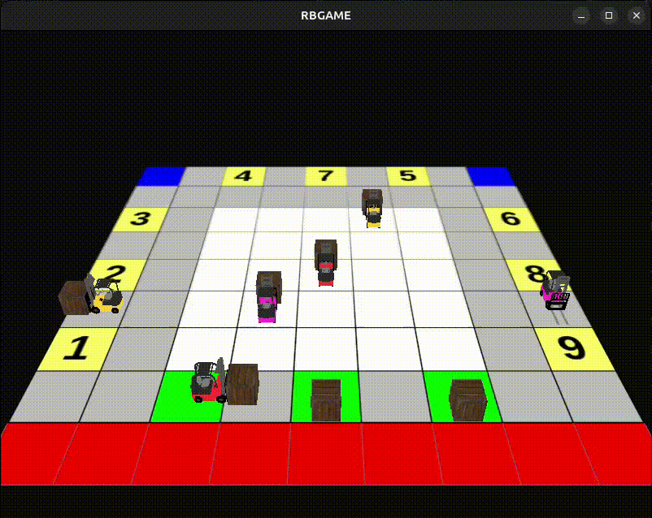

# Description
This is 3D version of [RBGAME](https://github.com/nguyenthanhtrung2910/robotic-board-game). This is first version so some memories and code styles haven't optimized. Program reads log file, created by running enviroment and pre-trained agents in [RBGAME](https://github.com/nguyenthanhtrung2910/robotic-board-game)
and simulates that process in 3D.

# Build requirements
- OpenGL verson 4.6.
- [GLFW](https://www.glfw.org/) for some stuffs like create OpenGL context, define window parameters, and handle user input.
- [GLAD](https://glad.dav1d.de/) for quickly retrieval OpenGL's functions. Go to [GLAD](https://glad.dav1d.de/), make sure the language is set to C++, and in the API section select OpenGL version 4.6. Also make sure the profile is set to *Core* and that the *Generate a loader* option is ticked. Ignore the extensions and click *Generate* to produce the resulting library files. Copy both include folders (glad and KHR) into your include directoy, and add the glad.c file to project. 
- [GLM](https://glm.g-truc.net/0.9.8/index.html), an easy-to-use and tailored-for-OpenGL mathematics library. GLM can be downloaded from their [website](https://glm.g-truc.net/0.9.8/index.html). Copy the root directory of the header files into your include folder.
- [Assimp](https://assimp.org/) for 3D model importing.

For now you can quickly build by simple command:
```bash
g++ main.cpp shader.cpp model.cpp game.cpp glad.c -o rbgame -lglfw -lGL -lX11 -lpthread -lXrandr -lXi -ldl -lassimp
```
Cmake files I will write after.

# Runtime requirements
**OpenGL**, **GFLW** and **Assimp**

Run by reading from .log file:
```bash
./rbgame events.log
```